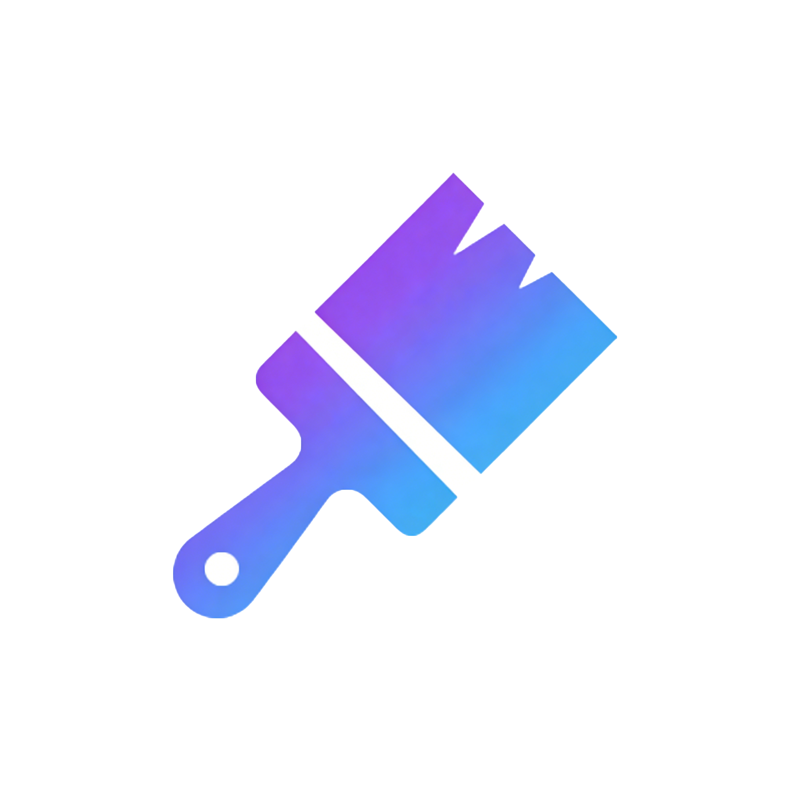

#  UTheme
A Wii U theme manager and installer with network download support. Download, preview, install and manage Wii U themes directly from your console!

## Features
- 🎨 **Browse & Download Themes** - Access themes from online repository
- 🖼️ **HD Preview** - View high-quality theme previews before installing
- 📦 **One-Click Install** - Automatic theme patching.
- 🗂️ **Theme Management** - View, update, and uninstall installed themes
- 🌍 **Multi-Language** - Support for Chinese, English, and Japanese
- ⚙️ **Settings** - Customize logging, language, and music preferences

> :information_source: **UTheme requires the [MochaPayload](https://github.com/wiiu-env/MochaPayload)!**  
> Make sure to update to [Aroma](https://aroma.foryour.cafe) or [Tiramisu](https://tiramisu.foryour.cafe) to use this application.

## Screenshots
Coming soon...

## Installation
1. Download the latest release from the [Releases](https://github.com/xziip/utheme/releases) page
2. Extract `UTheme.wuhb` to `sd:/wiiu/apps/`

## Usage
### Download Themes
1. Select **"Download Themes"** from the main menu
2. Browse available themes with preview images
3. Touch or press **A** to view theme details
4. Press **A** again to download and install

### Manage Themes
1. Select **"Manage Themes"** from the main menu
2. View all installed themes
3. Select a theme to view details, or uninstall

### Settings
- **Logging**: Enable detailed logging for troubleshooting
- **Language**: Switch between Chinese, English, and Japanese
- **Background Music**: Toggle BGM on/off (auto-downloads BGM on first launch)

## Background Music
UTheme automatically downloads background music on first launch. The BGM is downloaded from:
```
https://raw.githubusercontent.com/xziip/utheme/main/data/BGM.mp3
```

You can customize the BGM by:
- Placing your own `BGM.mp3` or `BGM.ogg` in `sd:/UTheme/`
- Editing `sd:/wiiu/utheme.cfg` and changing the `bgmurl=` line 

## Building
For building you need: 
- [wut](https://github.com/devkitPro/wut)
- [libmocha](https://github.com/wiiu-env/libmocha)
- [wiiu-sdl2](https://github.com/GaryOderNichts/SDL/tree/wiiu-sdl2-2.26)
- wiiu-sdl2_ttf
- wiiu-sdl2_image
- wiiu-sdl2_mixer
- wiiu-curl
- wiiu-mbedtls
- wiiu-zlib

### Build with Docker
```bash
# Build docker image (only needed once)
docker build . -t utheme_builder

# Build the project
docker run -it --rm -v ${PWD}:/project utheme_builder make

# Clean build files
docker run -it --rm -v ${PWD}:/project utheme_builder make clean
```

## Format the code via docker

`docker run --rm -v ${PWD}:/src ghcr.io/wiiu-env/clang-format:13.0.0-2 -r ./source -i`

## File Structure
```
sd:/
├── themes/            # Downloaded theme packages
├── wiiu/
│   ├── apps/
│   │   └── UTheme/
│   │       └── UTheme.wuhb
│   └── utheme.cfg         # Configuration file
└── UTheme/
    ├── installed/         # Installed theme metadata
    ├── cache/             # Theme list cache
    └── BGM.mp3           # Background music (auto-downloaded)
                          # BGM source : Shop - nico's nextbots
```


## Contributing
Contributions are welcome! Please feel free to submit a Pull Request.

## Support
If you encounter any issues or have questions:
- Check the logs in `sd:/wiiu/logs/utheme.log` (enable logging in settings)
- Open an issue on [GitHub](https://github.com/xziip/utheme/issues)
